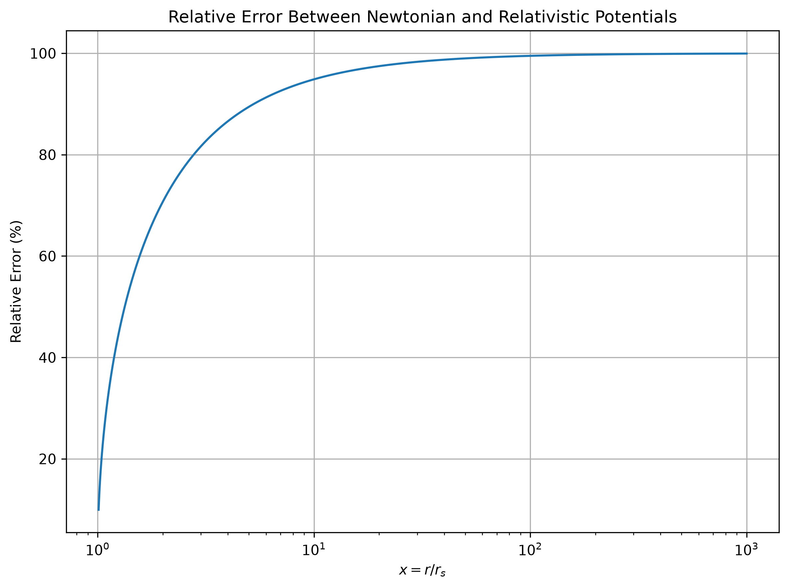
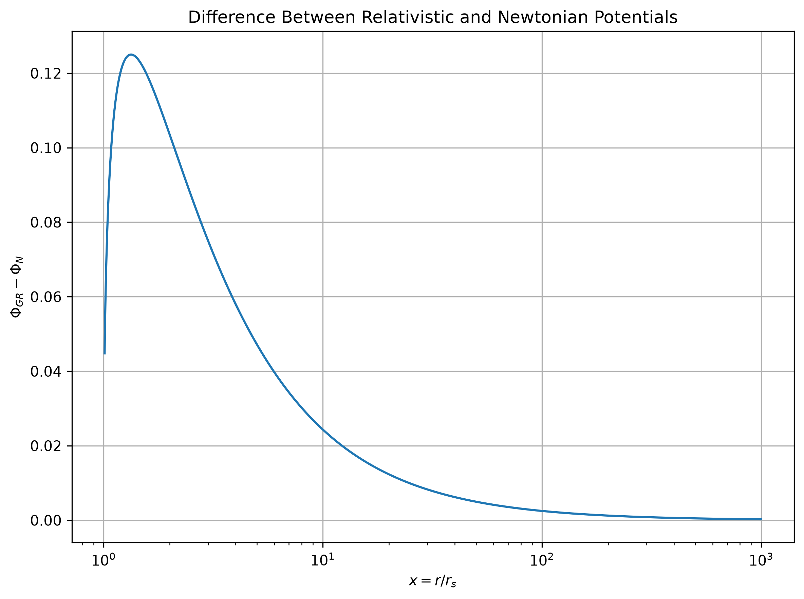
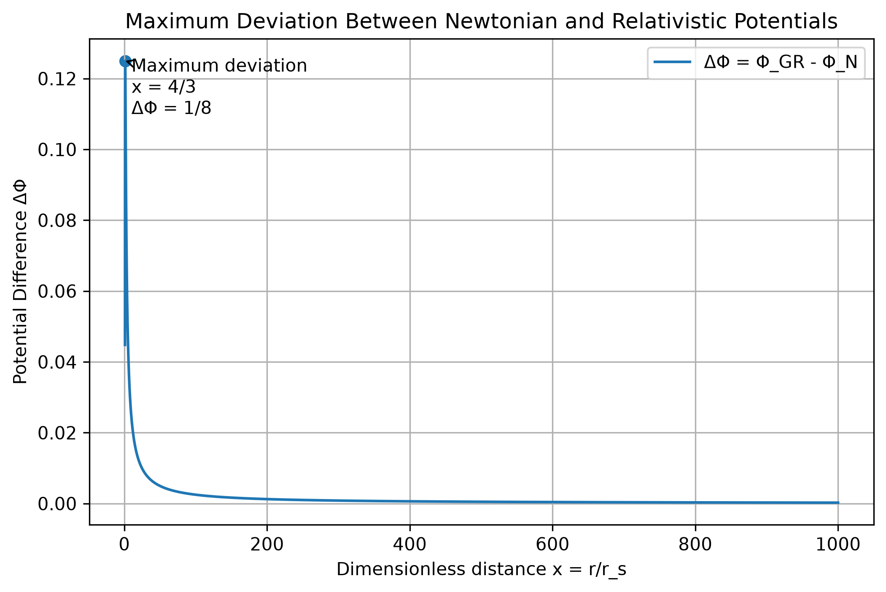
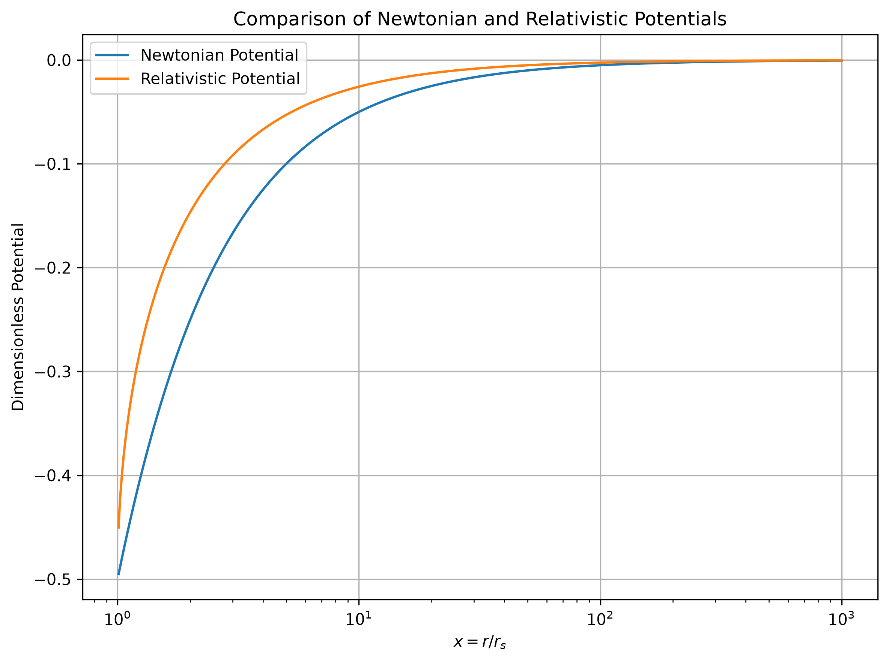
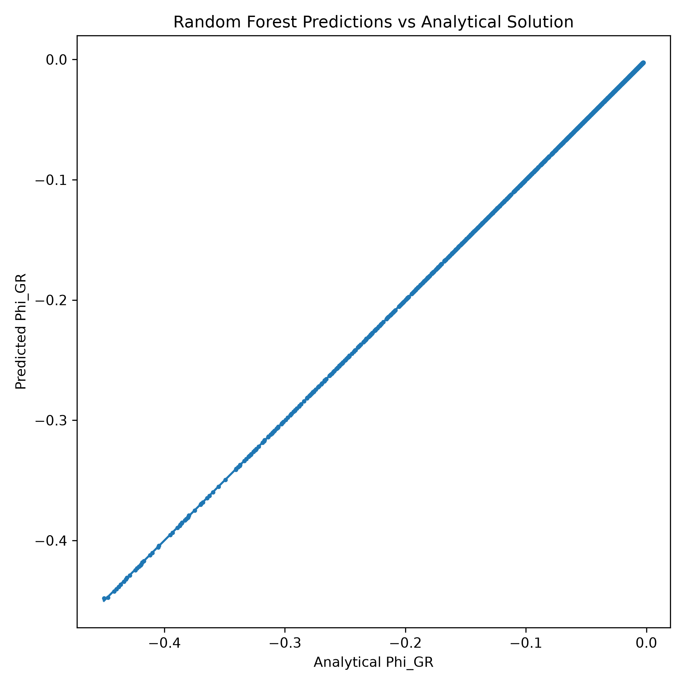
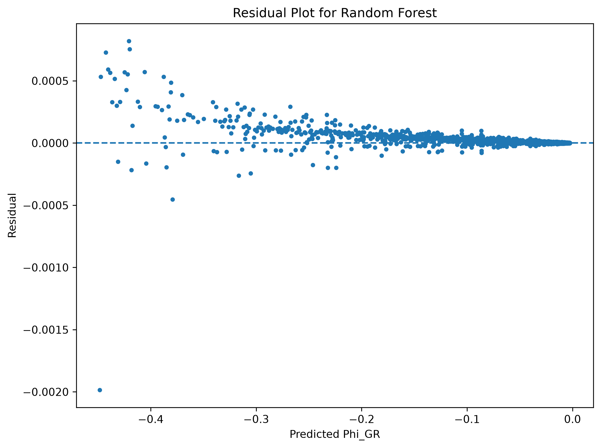
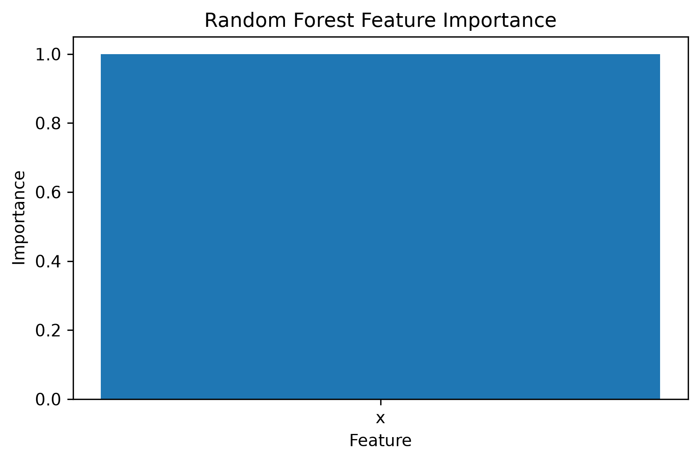

# Machine Learning-Assisted Analysis of a Static Relativistic Gravitational Potential: A Comparative Study with Newtonian Approximation and Error Quantification

# Abstract

Understanding the range of validity of classical gravitational models and identifying regimes where relativistic corrections become significant is an important problem in computational physics. In this work, we investigate a static Schwarzschild-inspired relativistic potential through a combined analytical, numerical, and machine-learning-based approach.

The relativistic formulation is analyzed and compared with the corresponding Newtonian approximation through mathematical derivation and computational error analysis. The deviation between the two models is quantified using relative error measurements, allowing the transition between strong-field and weak-field gravitational regimes to be studied systematically.

To explore the capability of data-driven methods in approximating nonlinear physical systems, a computational dataset is generated from the analytical model and used to train multiple machine learning algorithms. Linear regression, polynomial regression, neural networks, and random forest regression are evaluated to compare their ability to reproduce the behavior of the relativistic potential.

The results demonstrate that machine learning models can effectively approximate the underlying physical relationship, with nonlinear approaches providing significantly improved performance over simpler regression methods. The predictions are interpreted as computational approximations that complement the analytical formulation rather than replacing the physical model.

This work presents a framework that combines theoretical physics, numerical analysis, and machine learning for studying nonlinear scientific systems. The approach highlights the potential of machine learning as a tool for computational modeling while maintaining consistency with established physical principles.

# 1. Introduction

## 1.1 Motivation and Scientific Context
Mathematical modelling plays a fundamental role in physics by providing a framework for describing, analysing, and predicting the behaviour of physical systems. The accuracy of a mathematical model depends strongly on the physical regime in which it is applied, and understanding its range of validity remains an important aspect of theoretical and computational investigations.

Gravitational systems provide a significant example of the limitations associated with different theoretical descriptions. Newtonian gravity, introduced through Philosophiae Naturalis Principia Mathematica, successfully describes a wide range of gravitational phenomena under classical assumptions [1]. However, its applicability becomes limited in regimes involving extremely strong gravitational fields, where the effects of spacetime curvature cannot be neglected. In such situations, general relativity provides a more accurate description of gravitational interactions by incorporating the relationship between matter, energy, and spacetime geometry [2].

The transition between classical and relativistic descriptions represents an important computational problem, as it requires quantitative evaluation of the deviation between different theoretical models. The Schwarzschild solution provides one of the fundamental relativistic models for describing the gravitational field of a spherically symmetric mass distribution and serves as an important reference for analysing relativistic corrections to Newtonian predictions [3].

Understanding the applicability limits of classical gravitational models and identifying the conditions under which relativistic corrections become significant remain important challenges in computational physics. In this study, this problem is investigated using an integrated computational framework combining analytical formulation, numerical analysis, and machine learning techniques. Rather than modifying existing gravitational theories, the objective is to examine how computational approaches can quantify model differences and provide efficient approximations of the underlying physical relationships.

## 1.2 Background of Relativistic Potential Models
The mathematical description of gravitational interactions has evolved from Newtonian mechanics to relativistic theories, reflecting the development of our understanding of the relationship between matter, energy, and spacetime geometry [1,2]. In Newtonian mechanics, gravitational effects are represented through forces and potentials, where the gravitational potential provides a convenient mathematical representation of the interaction between massive bodies [1].

The Newtonian gravitational potential provides highly accurate predictions when gravitational fields are sufficiently weak and spacetime curvature effects can be neglected. This weak-field approximation forms the foundation for many classical gravitational calculations due to its simplicity and computational efficiency [1].

However, in regions of strong gravitational influence, the assumptions underlying Newtonian theory become insufficient. General relativity describes gravity as a consequence of spacetime curvature and introduces corrections that become increasingly important as the gravitational field strength increases [2]. The Schwarzschild metric represents one of the simplest exact solutions of Einstein's field equations and provides a theoretical framework for analysing such relativistic effects [3].

Relativistic models differ from Newtonian descriptions due to corrections arising from the geometric structure of spacetime. These differences become increasingly significant near compact astrophysical objects, where gravitational fields are sufficiently strong for relativistic effects to influence observable behaviour [2,3].

A quantitative comparison between Newtonian and relativistic models enables the identification of the range within which classical approximations remain reliable. In this work, a static relativistic potential model is examined alongside its Newtonian approximation through analytical derivation, numerical error analysis, and machine learning-based approximation techniques.

## 1.3 Computational Physics and Machine Learning
Computational methods have become an essential component of modern scientific research by enabling the investigation of complex systems that may be difficult to analyse using purely analytical approaches. Numerical techniques allow theoretical models to be evaluated across broad parameter spaces and provide insight into relationships between physical variables.

However, repeated numerical evaluation of complex mathematical models may become computationally expensive when exploring large parameter domains. This has motivated the development of data-driven approaches capable of learning underlying patterns and constructing efficient approximations of scientific models.

Machine learning provides a framework for identifying complex relationships within datasets and constructing predictive models based on learned patterns [5]. Several machine learning algorithms, including regression models, neural networks, and ensemble methods, have been widely applied in scientific computing and data-driven modelling [4–8].

In scientific applications, machine learning models require careful validation against established theoretical principles. Unlike purely predictive applications, scientific machine learning emphasises the importance of interpretability, physical consistency, and quantitative error evaluation [9].

The integration of machine learning with analytical and numerical approaches provides a complementary methodology for studying physical systems. In this study, machine learning algorithms are applied to a static relativistic potential system to investigate their capability to approximate the relationship between model parameters and gravitational potential behaviour. The machine learning component is considered as a supporting computational technique rather than a replacement for analytical physical modelling.

## 1.4 Research Gap and Objectives
Although Newtonian and relativistic descriptions of gravitational systems have been extensively studied [1-3], a computational framework combining theoretical comparison, quantitative error evaluation, and machine learning-based approximation provides an opportunity to investigate the transition between classical and relativistic regimes from a unified perspective.

Previous investigations have primarily focused on either analytical treatments of relativistic corrections or numerical approaches for studying gravitational systems. However, the integration of model comparison, error quantification, and scientific machine learning techniques into a single framework remains an interesting direction for exploring the applicability limits of classical gravitational models.

The primary objective of this study is to develop a computational framework combining analytical physics modelling, numerical error analysis, and machine learning approaches for analysing a static relativistic gravitational potential and its Newtonian approximation.

The specific objectives are:

1. To formulate the mathematical representation of the static relativistic potential and its Newtonian approximation.
2. To quantify the deviation between the two models using relative error analysis.
3. To investigate the transition between weak-field and strong-field gravitational regimes through error behaviour.
4. To generate a computational dataset derived from the theoretical gravitational model.
5. To evaluate different machine learning approaches, including regression-based models, neural networks, and ensemble methods [4-8].
6. To compare the performance of these models and analyse their suitability for approximating gravitational relationships.
 
The main contribution of this work is the development of a unified analytical, numerical, machine learning framework for studying the relationship between Newtonian and relativistic gravitational models. The study demonstrates how machine learning can be incorporated as a complementary computational technique while maintaining a foundation based on established physical principles.

## 1.5 Organization of the Paper

The remainder of this paper is organized as follows. Section 2 presents the theoretical framework of the static relativistic potential model and its Newtonian approximation. Section 3 describes the mathematical formulation of the gravitational potentials and the derivation of the relative error expression. Section 4 presents the numerical error analysis and examines the transition between weak-field and strong-field regimes. Section 5 discusses gravitational field analysis and comparative behaviour of the two models. Section 6 describes dataset construction and preparation for machine learning applications. Section 7 introduces the machine learning framework and presents the evaluated models. Section 8 discusses the computational results, model performance, and physical interpretation. Finally, Section 9 presents the conclusions, limitations, and possible future extensions of the study.

# 2. Theoretical Framework

## 2.1 Physical Motivation
Mathematical models describing physical systems need to be accurate and reflect correctly the physical phenomena occurring within such systems depending on various conditions. While classical gravitational systems give reliable predictions in many cases, their limitations arise when dealing with strong enough gravitational fields and relativistic effects.

Comparison of different descriptions gives insight into the boundaries of applicability of one or another physical model. The comparison of the deviation between such models enables us to quantify the transition from one regime to another.

In the case of the weak-field approximation, the Newtonian approximation gives a good description, while relativistic corrections can be neglected. As the characteristic distance from the gravitational field decreases, relativistic corrections start to play a bigger role and the classical description becomes less precise.

The aim of this work is to examine the process of the transition from the classical to the relativistic description by constructing a computational framework which allows us to compare the relativistic and the Newtonian potentials.

By using analytical analysis, numerical calculations and machine learning algorithms we will investigate not only the physical characteristics of the system but also the possibility of obtaining computational approximations.

The theoretical framework proposed in this section serves as a basis for the subsequent mathematical description, analysis of errors and machine learning experiments.

## 2.2 Dimensionless Representation
In order to facilitate the mathematical manipulation of the model and generalize the outcome to various physical scales, the gravitational field is expressed in terms of a dimensionless variable.

The normalization of the radius vector is done using the characteristic length of the relativistic gravitational system:

$$
x=\frac{r}{r_s}
$$

where:

- (r) represents the radial distance from the gravitational source.
- (r_s) represents the characteristic relativistic scale of the system.
- (x) is the normalized dimensionless radial parameter.

Dimensional variable gives several benefits. First, it eliminates dependence on the specific physical units and allows the system to be studied in terms of the relative distance instead of the absolute one.

The variable (x) can be also used for the examination of various gravitational regimes. The values of the variable (x) that are close to the characteristic length correspond to the relativistic gravitational systems. Larger values of the variable (x) correspond to gravitational systems with low intensity where classical approximation is a better choice.

In terms of this normalized distance both the relativistic and Newtonian potential models can be expressed, and thus the comparison between them 
will not depend on any specific physical system but will rely only on mathematics.

This dimensionless formulation forms the basis for the analytical derivations and computational simulations performed in the following sections.

## 2.3 Newtonian Approximation

Newtonian gravitational potential gives the classical description of the gravitational field created by the mass distribution. It assumes that the gravitational interaction can be described by means of the force field in the fixed space-time.

Standard Newtonian gravitational potential is presented as follows:

$$
\Phi_N = -\frac{GM}{r}
$$

where:

* (G) is the gravitational constant;
* (M) is the mass of the gravitational source;
* (r) is the radial distance from the source.

This expression follows the classical gravitational framework introduced by Newtonian mechanics [4].

In order to provide the comparison between the Newtonian and relativistic potentials, the potential will be written using the dimensionless radial coordinate:

$$
x=\frac{r}{r_s}
$$

Thus, after the normalization, the Newtonian potential can be written as follows:

$$
\Phi_N(x)=-\frac{1}{2x}
$$

This formula gives the weak-field approximation for the gravitational system. With the increase of the value (x), the gravitational field becomes weaker and more accurately approximated by the Newtonian potential.

The Newtonian model is considered to be the reference case for this paper. The difference between this model and relativistic potential allows determining the order of the relativistic corrections by evaluating their relative error.

Although the Newtonian approximation is highly effective in many applications, its limitations become apparent near regions where relativistic effects cannot be neglected. Therefore, analyzing its deviation from the relativistic model provides a quantitative measure of the transition between classical and relativistic gravitational behavior.

## 2.4 Static Relativistic Potential Model

To incorporate relativistic effects, a static relativistic gravitational potential derived from the Schwarzschild metric is considered.

The relativistic potential is defined as:

$$
\Phi_{GR}(r)=
\frac{c^2}{2}
\left(
\sqrt{1-\frac{2GM}{rc^2}}
-1
\right)
$$

where:

* (G) is the gravitational constant,
* (M) is the mass of the gravitating source,
* (r) is the radial distance,
* (c) is the speed of light.

This formulation is based on the static gravitational solution obtained from the Schwarzschild metric [2].

Using the Schwarzschild radius

$$
r_s=\frac{2GM}{c^2}
$$

and the dimensionless coordinate

$$
x=\frac{r}{r_s},
$$

the relativistic potential can be written in normalized form as

$$
\Phi_{GR}(x)=
\frac12
\left(
\sqrt{1-\frac1x}
-1
\right).
$$

Unlike the Newtonian approximation, this expression contains nonlinear relativistic corrections that become increasingly important near the Schwarzschild radius, such corrections arise from the relativistic description of spacetime geometry in general relativity [1,3]. For large values of (x), the relativistic potential approaches the same inverse-distance scaling behavior as the Newtonian approximation, but the two expressions retain a difference in their leading-order coefficients. Therefore, the weak-field behavior is qualitatively similar while a systematic quantitative discrepancy remains under the chosen normalization.

The relativistic potential serves as the primary physical model investigated in this work and forms the basis for the numerical analysis, error calculations, and machine learning experiments presented in later sections.

## 2.5 Relativistic–Newtonian Comparison

The Newtonian and relativistic potential models describe the same gravitational system but differ in their treatment of gravitational effects.

The Newtonian potential provides a classical approximation that assumes weak gravitational fields and neglects relativistic corrections. In contrast, the relativistic potential incorporates nonlinear effects that arise from the relativistic description of gravity.

A comparison of the two models allows the accuracy of the classical approximation to be evaluated as a function of the normalized radial coordinate. In regions far from the characteristic relativistic scale, the two potentials exhibit similar functional behavior, allowing Newtonian gravity to provide a qualitative approximation. However, quantitative comparison through relative error analysis is required to determine the accuracy of this approximation.

Closer to the strong-field region, however, the difference between the models becomes increasingly significant. This deviation reflects the growing importance of relativistic corrections and motivates the use of quantitative error analysis.

To measure the discrepancy between the two descriptions, a relative error function is introduced in the following section. This function provides a numerical basis for evaluating the validity range of the Newtonian approximation and identifying the transition between classical and relativistic gravitational behavior.

# 3. Mathematical Formulation

## 3.1 Relativistic Potential Equation

The relativistic gravitational potential investigated in this study is derived from the Schwarzschild solution and is expressed as

$$
\Phi_{GR}(r)=
\frac{c^2}{2}
\left(
\sqrt{1-\frac{2GM}{rc^2}}
-1
\right).
$$

Introducing the Schwarzschild radius

$$
r_s=\frac{2GM}{c^2}
$$

and the dimensionless coordinate

$$
x=\frac{r}{r_s},
$$

the normalized relativistic potential becomes

$$
\Phi_{GR}(x)=
\frac12
\left(
\sqrt{1-\frac1x}
-1
\right).
$$

This equation represents the reference relativistic model used throughout the study. The nonlinear square-root dependence introduces deviations from classical gravity that become significant near the Schwarzschild radius.

For large values of (x), the relativistic potential follows the same inverse-distance dependence as the Newtonian approximation. However, because the leading-order coefficients differ, the two potentials do not converge to the same normalized value. This difference is quantified through the relative error analysis performed in later sections.Therefore, the weak-field limit in this formulation should be interpreted as convergence in functional behavior rather than exact numerical agreement between the two normalized potentials.

## 3.2 Newtonian Potential Equation
The Newtonian gravitational potential is taken as the classical reference potential for comparison purposes with the relativistic potential equation. The potential equation represents the gravitational effect of the mass source assuming that the effects of spacetime and the gravitational field are in the weak-field approximation region.

The standard Newtonian gravitational potential is given by:

$$\Phi_N(r)=-\frac{GM}{r}$$

where:

(G) is the gravitational constant,

(M) represents the mass of the source,

(r) represents the radial distance from the source.

Using the dimensionless radial coordinate introduced previously:

$$x=\frac{r}{r_s}$$

the Newtonian potential can be rewritten in normalized form as:

$$\Phi_N(x)=-\frac{1}{2x}$$

This normalized expression provides a simplified representation that allows direct comparison with the relativistic potential model.

The Newtonian approximation serves as the standard for which the relativistic corrections are taken into consideration. For large values of (x), both models exhibit similar inverse-distance behavior. However, the relative error analysis is required to determine the actual quantitative agreement between the two descriptions.
However, as (x) goes deeper into stronger-field regions, the relativistic potential starts to differ from the classical approximation.

## 3.3 Derivation of Relative Error Expression

To quantify the difference between the relativistic and Newtonian descriptions, the relative error between the two potential models is calculated.

The relative error provides a measure of how much the Newtonian approximation deviates from the relativistic potential at a given value of the normalized radial coordinate (x).

The general form of the relative error is defined as:

$$
\epsilon(x)=
\left|
\frac{\Phi_{GR}(x)-\Phi_N(x)}
{\Phi_{GR}(x)}
\right|
\times 100
$$

where:

* (\Phi_{GR}(x)) represents the relativistic potential,
* (\Phi_N(x)) represents the Newtonian approximation,
* (\epsilon(x)) represents the percentage deviation between the two models.

Substituting the expressions for the relativistic and Newtonian potentials into the error equation gives a mathematical relationship describing the accuracy of the classical approximation across different gravitational regimes.

This error function allows the transition between relativistic and classical behavior to be studied quantitatively. When (\epsilon(x)) is small, the Newtonian model provides a close approximation to the relativistic system. However, an increasing value of (\epsilon(x)) indicates that relativistic corrections become significant.

The resulting error function is evaluated computationally over a range of (x) values to analyze the behavior of the approximation and identify regions where classical gravity remains sufficiently accurate.

This formulation provides the connection between the theoretical model and the numerical analysis performed in this study.

## 3.4 Simplified Error Formula

After substituting the relativistic and Newtonian potential expressions into the relative error equation, the resulting expression can be simplified to obtain a direct relationship between the error and the normalized radial coordinate (x).

The simplified form obtained is:

$$
\epsilon(x)=
100
\left|\frac{
-x^{3/2}+\sqrt{x}+x\sqrt{x-1}
}
{
x(-\sqrt{x}+\sqrt{x-1})
}\right|
$$

This expression represents the percentage deviation between the relativistic potential and the Newtonian approximation as a function of the dimensionless radial coordinate.

The equation provides a direct way to analyze how the accuracy of the Newtonian model changes across different gravitational regimes. As (x) increases, the relativistic corrections become smaller and the error approaches the weak-field limit, where the Newtonian approximation becomes increasingly accurate.

Conversely, for values of (x) closer to the strong-field region, the deviation between the two models becomes more significant. This behavior reflects the increasing influence of relativistic effects as the system moves away from the conditions where classical gravity provides a reliable approximation.

The simplified error expression is particularly useful because it removes the need to repeatedly compare the two potential functions separately. Instead, the accuracy of the Newtonian approximation can be directly evaluated from a single mathematical relationship.

This analytical formulation is later used for numerical error analysis, including the determination of accuracy thresholds and the identification of the transition region between relativistic and classical gravitational behavior.

# 4. Error Analysis

## 4.1 Error Behaviour
The relative error function derived in the previous section provides a quantitative measure of the difference between the relativistic potential and the Newtonian approximation. By evaluating this function over a range of values of the normalized radial coordinate (x), the accuracy of the classical model can be studied.

The behavior of the error is expected to depend strongly on the gravitational regime being considered. In regions closer to the characteristic relativistic scale, the effects of relativistic corrections become more significant, resulting in a larger deviation between the two potential models.

As the value of (x) increases, the gravitational field becomes weaker and the functional behavior of the relativistic and Newtonian descriptions becomes increasingly similar. However, due to the difference in their asymptotic normalization, the relative error does not decrease to zero and instead approaches a limiting value.

The variation of the relative error with respect to the normalized radial coordinate is shown in Figure 1.

**Figure 1: Relative error between the relativistic potential and Newtonian approximation over the investigated domain.** 

This behavior demonstrates the transition from a region where relativistic corrections significantly modify the potential toward a region where both models exhibit similar qualitative inverse-distance behavior. However, due to the difference in asymptotic normalization, the Newtonian model does not achieve vanishing relative error under the chosen formulation.

The numerical evaluation of the error function allows this transition to be examined quantitatively rather than only through theoretical assumptions. By measuring how the error changes with (x), the range in which Newtonian gravity achieves a specified accuracy can be determined.

The error analysis therefore provides an important link between the theoretical formulation and the quantitative evaluation of the classical approximation within the considered model.

## 4.2 Error Threshold Analysis

A numerical threshold analysis was performed to determine whether the Newtonian approximation reaches commonly used accuracy levels within the sampled domain.

The threshold condition was defined as:

$$
\epsilon(x)\leq \epsilon_{limit}
$$

where (\epsilon_{limit}) represents a specified maximum relative error.

Three thresholds were investigated:

* 10% relative error,
* 5% relative error,
* 1% relative error.

The numerical evaluation showed that the relative error reaches its minimum value near the lower boundary of the investigated domain:

$$
x = 1.01
$$

with a corresponding relative error of approximately:

$$
\epsilon = 9.950372%
$$

However, the analysis further revealed that the relative error never falls below either the 5% or 1% thresholds within the investigated domain:

$$
1.01 \le x \le 1000
$$

The minimum observed relative error across the sampled dataset was approximately 9.95%.

These results indicate that, for the specific relativistic potential considered in this study, the Newtonian approximation does not achieve better than approximately 10% accuracy within the investigated domain. The minimum relative error occurs near the lower boundary of the sampled range (x = 1.01), while the discrepancy increases as x becomes larger.

This behavior arises from the different asymptotic forms of the two potentials. In the large-distance limit, the relativistic potential approaches Φ_GR ≈ -1/(4x), whereas the Newtonian approximation follows Φ_N = -1/(2x). Consequently, the relative error increases toward 100% as x → ∞ rather than remaining near 10%. Therefore, the observed 9.95% value represents the minimum error within the chosen domain, not the asymptotic error behavior.

## 4.3 Strong-Field and Weak-Field Transition

The variation of the relative error with the normalized radial coordinate provides a way to identify the transition between strong-field and weak-field gravitational regimes.

In the strong-field region, where (x) approaches the characteristic relativistic scale, the assumptions behind the Newtonian approximation become less accurate. The contribution of relativistic corrections becomes more significant, leading to a larger difference between the relativistic and classical potential models.

As the value of (x) increases, the influence of relativistic corrections gradually decreases. The system moves toward the weak-field regime, where the Newtonian approximation becomes increasingly consistent with the relativistic description.

This transition can be understood through the behavior of the relative error. A larger error indicates that the classical approximation does not fully capture the physical behavior of the system, while a smaller error indicates that the Newtonian model provides an effective approximation.

By analyzing the points where the error crosses predefined accuracy limits, the boundary between these regimes can be estimated quantitatively. Instead of defining the transition only through theoretical assumptions, this approach provides a measurable criterion based on the accuracy of the approximation.

The identification of this transition region is important because it establishes the range in which classical gravitational models remain applicable and the range where relativistic corrections become necessary. This analysis also provides a physically meaningful interpretation of the dataset later used for machine learning experiments.

## 4.4 Asymptotic Behaviour

The asymptotic behavior of the relativistic and Newtonian potentials provides important insight into their relationship in the weak-field regime.

As the normalized radial coordinate (x) increases, both potentials approach an inverse-distance dependence, indicating similar qualitative behavior. However, they do not converge to the same value because their leading-order terms differ:

$$
\Phi_{GR}\approx-\frac{1}{4x}
$$

whereas

$$
\Phi_N=-\frac{1}{2x}.
$$

Therefore, the Newtonian approximation captures the general distance-dependent trend of the relativistic potential but retains a systematic quantitative discrepancy due to the difference in normalization.

Numerical evaluation of the relative error reveals that the minimum observed deviation within the investigated domain occurs near the lower boundary:

$$
\epsilon_{min}=9.950372\%
$$

at approximately:

$$
x=1.01.
$$

The difference between the relativistic and Newtonian potentials is shown in Figure 2, illustrating the systematic deviation between the two models.

**Figure 2: Difference between relativistic and Newtonian potential models.**

However, this minimum value should not be interpreted as the asymptotic error. As x increases, the relative error grows and approaches 100% in the large-distance limit because the ratio between the leading-order terms remains different.

This behavior explains why the 5% and 1% accuracy thresholds are never reached within the sampled range:

$$
1.01 \le x \le 1000.
$$

The location of the maximum deviation is further illustrated in Figure 3.

**Figure 3: Annotated potential difference showing the maximum deviation region.**

Therefore, while the Newtonian approximation reproduces the qualitative inverse-distance behavior of the relativistic potential, explicit error analysis reveals a persistent and increasing quantitative discrepancy. This result demonstrates the importance of evaluating approximation accuracy through numerical comparison rather than assuming convergence solely from similar functional behavior.

# 5. Gravitational Field Analysis

## 5.1 Newtonian Field
The gravitational field is obtained from the spatial variation of the potential. In the Newtonian framework, the gravitational field is defined as the negative gradient of the gravitational potential:

$$
g_N=-\frac{d\Phi_N}{dr}
$$

Using the Newtonian potential:

$$
\Phi_N(r)=-\frac{GM}{r}
$$

the corresponding gravitational field becomes:

$$
g_N=\frac{GM}{r^2}
$$

This represents the classical inverse-square behavior of gravity, where the field strength decreases with increasing distance from the source.

Using the normalized coordinate (x), the Newtonian field can be analyzed in terms of the relative distance scale rather than absolute units. This allows direct comparison with the relativistic field representation.

The Newtonian field provides the classical reference behavior for evaluating the influence of relativistic corrections. In the weak-field regime, it is expected to closely match the relativistic prediction, while deviations become more noticeable as the system approaches stronger gravitational regions.

The analysis of the Newtonian field therefore provides the baseline required for understanding how relativistic effects modify the gravitational behavior of the system.

## 5.2 Relativistic Field

In the relativistic description, the gravitational field is obtained from the variation of the relativistic potential with respect to the radial coordinate:

$$
g_{GR}=-\frac{d\Phi_{GR}}{dr}
$$

Unlike the Newtonian formulation, the relativistic field includes corrections that arise from the modified structure of the gravitational potential. These corrections become increasingly important in regions where the gravitational field is stronger.

The behavior of the relativistic field differs from the Newtonian prediction mainly due to the nonlinear dependence introduced by the relativistic formulation. At larger values of (x), where the gravitational field is weaker, the relativistic field gradually approaches the Newtonian result. However, closer to the strong-field region, the difference between the two descriptions becomes more significant.

The comparison of these two field models provides additional information beyond the potential analysis. While the potential comparison measures the difference in gravitational energy representation, the field comparison examines how the gravitational influence itself changes across different regimes.

This analysis helps establish a more complete understanding of the system by considering both the potential and the resulting field behavior before applying computational and machine learning methods.

## 5.3 Comparative Analysis

The comparison between the Newtonian and relativistic gravitational fields provides a broader perspective on the transition between classical and relativistic descriptions.

In the weak-field regime, the difference between the two models becomes minimal, indicating that Newtonian gravity provides an accurate approximation of the relativistic behavior. This agreement explains why classical gravitational models remain effective for many practical applications where relativistic corrections are extremely small.

However, as the system moves toward stronger gravitational regions, the relativistic corrections become increasingly important. The deviation between the two field descriptions reflects the limitations of the classical approximation and highlights the need for a relativistic treatment.

The combined analysis of potential and field behavior demonstrates that the transition from Newtonian to relativistic behavior is gradual rather than abrupt. The accuracy of the classical approximation depends on the physical regime being considered and can be quantified through computational error analysis.

This comparison provides additional validation for the dataset generation process used in this study. Since the machine learning models are trained on values derived from the relativistic formulation, understanding the physical behavior of the underlying system is essential for interpreting the predictions produced by the models.

# 6. Numerical Dataset Generation

## 6.1 Data Generation

The dataset used in this study was generated directly from the mathematical formulation of the static relativistic potential model. Instead of relying on externally collected data, the values were produced by evaluating the theoretical equations across a defined range of the normalized radial coordinate (x).

For each value of (x), the corresponding relativistic potential value was calculated and stored as the target physical quantity for machine learning analysis. The Newtonian approximation and error-related quantities were also evaluated to support comparison and validation.

The generated dataset represents the relationship between the input parameter and the resulting gravitational potential behavior. This approach ensures that the machine learning models are trained on data that follows the underlying physical laws represented by the mathematical model.

The dataset generation process can be summarized as:

1. Selecting a range of normalized radial coordinate values (x).

2. Evaluating the relativistic potential model for each value.

3. Storing the resulting input-output relationship.

4. Using the generated dataset for training and evaluating machine learning models.

By generating the dataset from the analytical model, the study creates a controlled environment where machine learning performance can be evaluated against a known physical relationship.

## 6.2 Dataset Range and Sampling
To analyze the behavior of the relativistic potential across different gravitational regimes, the dataset was generated over multiple ranges of the normalized radial coordinate (x).

Two different sampling ranges were considered in this study:

1. A focused dataset covering a smaller range of (x), designed to capture the behavior closer to the stronger-field region where relativistic effects are more significant.

2. A broader dataset extending to larger values of (x), allowing the analysis of the weak-field regime where the relativistic potential approaches the Newtonian approximation.

The smaller-range dataset was used for detailed analysis of the region where the potential changes more rapidly, while the extended-range dataset provided a wider representation of the overall behavior of the system.

Sampling across these ranges allows the machine learning models to learn both the nonlinear behavior present in stronger gravitational regions and the gradual convergence toward classical behavior at larger distances.

The choice of sampling range is important because machine learning models learn patterns from the provided data distribution. A dataset that includes both strong-field and weak-field behavior allows the trained models to develop a more complete representation of the underlying physical relationship.

This approach ensures that the computational experiments evaluate not only the predictive capability of machine learning models but also their ability to approximate physical behavior across different regimes.

## 6.3 Statistical Properties

Before applying machine learning algorithms, the generated dataset was analyzed to understand its structure and characteristics. Since the dataset is derived from a mathematical model, its statistical properties directly reflect the behavior of the underlying physical system.

The primary input variable is the normalized radial coordinate:

$$
x=\frac{r}{r_s}
$$

which represents the position parameter of the system. The corresponding target variable is the relativistic potential:

$$
\Phi_{GR}(x)
$$

which the machine learning models are trained to approximate.

The relationship between these variables is nonlinear, particularly in regions where relativistic effects become significant. This nonlinear behavior provides a suitable test case for evaluating different machine learning approaches, ranging from simple regression models to more flexible nonlinear models.

The dataset characteristics are important because the performance of a machine learning model depends strongly on the complexity and distribution of the available data. Regions with rapid changes in the potential require models capable of capturing nonlinear patterns, while smoother regions provide a simpler approximation problem.

The generated dataset therefore serves as a controlled scientific benchmark where the accuracy of machine learning models can be evaluated against a known physical relationship.

The combination of theoretical generation and statistical analysis ensures that the machine learning results can be interpreted in the context of the original gravitational model rather than as purely data-driven predictions.

The generated dataset contains 10,000 samples spanning the normalized radial coordinate range from x = 1.01 to x = 1000. Descriptive statistical analysis was performed to characterize the dataset prior to machine learning training.

The mean value of the normalized radial coordinate was 144.86, while the mean relativistic potential was −0.04379. The relative error between the Newtonian and relativistic models ranged from approximately 9.95% to 99.95%, with an average value of 91.24%.

These statistics indicate that significant deviations exist between the classical and relativistic descriptions throughout much of the sampled range. The wide variation of the potential values and error measurements provides a suitable benchmark for evaluating the approximation capabilities of different machine learning models.

# 7. Machine Learning Framework

## 7.1 Dataset Generation and Preparation

The numerical analysis and machine learning experiments were performed using separate datasets designed according to their respective objectives.

For analytical error evaluation, threshold analysis, and asymptotic behaviour, a dataset spanning the range:

$$
1.01 \leq x \leq 1000
$$

was generated. This range enables investigation of both strong-field and weak-field gravitational regimes.

For the machine learning experiments, the computational domain:

$$
1.01 \leq x \leq 100
$$

was selected. At very large values of x, the relativistic potential approaches a
slowly varying weak-field limit, causing reduced variation in the target function
and making the learning problem less informative. Therefore, the reduced
range was selected to provide a more meaningful representation of the nonlinear
structure of the potential.

The machine learning models were trained and evaluated using an 80:20 train-test split.

The dataset consists of the normalized radial coordinate $x$ as the input feature and the relativistic potential:

$$
\phi_{GR}(x)
$$

as the target variable.

Additional physical quantities, including the Newtonian potential, potential difference, and relative error, were calculated and retained for numerical analysis. However, these quantities were not used as input features for the machine learning models, ensuring that the models learned the direct relationship between the radial coordinate and the relativistic potential.

The generated dataset was constructed directly from the analytical formulation of the gravitational model, providing a controlled environment for evaluating machine learning approximation methods.

## 7.2 Problem Definition

The objective of the machine learning component of this study was to develop computational models capable of approximating the behaviour of the static relativistic potential using data generated from the theoretical formulation.

The problem was formulated as a supervised learning task, where the normalized radial coordinate acts as the input variable and the corresponding relativistic potential value represents the target output:

$$
x \rightarrow \phi_{GR}(x)
$$

Supervised machine learning methods learn relationships between input variables and target outputs from labelled datasets and are widely used for nonlinear regression problems [6].

The purpose of these models was to learn an efficient approximation of the relationship between the input parameter and the physical quantity, allowing rapid prediction without repeatedly evaluating the original analytical expression.

Several machine learning approaches with different levels of complexity were evaluated to investigate how model architecture influences approximation accuracy. The selected models represented different learning strategies:

- Linear regression, providing a simple baseline approximation.
- Polynomial regression, introducing nonlinear feature relationships.
- Neural networks, capable of learning complex nonlinear patterns.
- Random forest regression, using ensemble-based decision models to capture nonlinear relationships.

Each model was evaluated using standard regression metrics and compared against the analytical solution to determine its ability to approximate the relativistic potential.

This framework allowed investigation of not only whether machine learning could reproduce the physical relationship, but also how different algorithms performed when applied to a scientifically generated dataset.

All machine learning models were implemented using the Scikit-learn library [4].

## 7.3 Linear Regression

Linear regression was used as the first baseline model to evaluate the extent to which a simple mathematical approximation could represent the behaviour of the relativistic potential.

The model assumes a linear relationship between the input variable and the target output:

$$
\hat{y}=ax+b
$$

where:

- $\hat{y}$ represents the predicted potential value,
- $x$ represents the normalized radial coordinate,
- $a$ and $b$ represent the parameters learned during training.

Although the actual relationship between $x$ and $\phi_{GR}(x)$ is nonlinear, linear regression provides a useful reference point for understanding the complexity of the approximation problem.

The purpose of including this model was not to achieve the highest prediction accuracy, but to establish a baseline performance level. Poor performance from a linear model indicates that the underlying physical relationship contains significant nonlinear behaviour that cannot be represented through a simple approximation.

The trained linear regression model was evaluated using standard regression metrics and compared with more advanced models in subsequent sections.

This comparison demonstrates how increasing model flexibility influences the ability of machine learning methods to approximate nonlinear physical relationships.

Regression methods are commonly used as baseline approaches for analysing relationships between variables in statistical learning [6].

## 7.4 Polynomial Regression

Polynomial regression was introduced to investigate whether incorporating nonlinear terms improves the approximation of the relativistic potential compared with a simple linear model.

Unlike linear regression, which assumes a direct proportional relationship between input and output, polynomial regression expands the input variable into higher-order terms:

$$
\hat{y}=a_0+a_1x+a_2x^2+...+a_nx^n
$$

where the coefficients:

$$
a_0,a_1,...,a_n
$$

are learned from the training data.

By including additional powers of $x$, the model gains the ability to represent more complex curves and approximate nonlinear relationships. This makes polynomial regression an intermediate approach between simple linear models and more flexible machine learning architectures.

However, increasing polynomial complexity may introduce overfitting, where the model learns specific characteristics of the training data but performs poorly on unseen examples.

In this study, polynomial regression was used to evaluate whether a mathematically enhanced regression approach could capture the nonlinear behaviour of the relativistic potential. Its performance was compared with both simpler regression methods and more advanced machine learning models.

The results provide insight into whether the complexity of the physical relationship can be represented through traditional mathematical transformations or requires more flexible learning architectures.

## 7.5 Neural Network

A neural network model was introduced to evaluate whether a flexible learning architecture could capture the nonlinear relationship present in the relativistic potential system.

Unlike traditional regression methods, neural networks learn complex relationships through interconnected computational units arranged in multiple layers. The theoretical foundation of neural networks and deep learning methods has been extensively discussed in modern machine learning literature [7].

The general structure of a neural network consists of:

- an input layer,
- one or more hidden layers,
- an output layer.

In this study, the input variable was the normalized radial coordinate:

$$
x
$$

and the output was the predicted relativistic potential:

$$
\hat{\phi}_{GR}(x)
$$

The model learned an approximation function:

$$
f(x) \approx \phi_{GR}(x)
$$

during training by adjusting internal parameters to minimize the difference between predicted and analytical values.

The advantage of neural networks in this problem lies in their ability to represent nonlinear relationships without requiring an explicitly defined mathematical form. Since the relativistic potential contains nonlinear behaviour, this flexibility allows neural networks to capture patterns that simpler regression models may fail to reproduce.

The neural network performance was evaluated using regression metrics and compared with other models. The objective was not to replace the analytical formulation but to investigate whether a learned computational approximation could accurately reproduce the behaviour of the physical model.

## 7.6 Random Forest

Random forest regression was included as an ensemble-based machine learning approach for approximating the relativistic potential.

A random forest consists of multiple decision trees trained using different subsets of the dataset. The method follows the ensemble learning approach introduced by Breiman [8].

Each decision tree learns relationships between the input variable and target output, while the final prediction is obtained by combining the outputs of all individual trees.

The prediction process can be represented as:

$$
\hat{y}=\frac{1}{N}\sum_{i=1}^{N}T_i(x)
$$

where:

- $T_i(x)$ represents the prediction from the $i^{th}$ decision tree,
- $N$ represents the total number of trees,
- $\hat{y}$ represents the final predicted output.

The advantage of random forest regression is its ability to model nonlinear relationships while reducing the risk of overfitting compared with individual decision trees.

Since the relativistic potential exhibits nonlinear behaviour, an ensemble of decision-based models can effectively capture variations within the generated dataset.

In this study, random forest regression was evaluated alongside regression-based models and neural networks to compare different learning strategies.

The high predictive accuracy achieved by the model demonstrates that machine learning techniques can approximate the numerical behaviour of the relativistic potential when sufficient and representative training data are provided.

However, these predictions remain dependent on the quality and range of the underlying physical dataset. Since the training data is generated from the analytical model, the machine learning performance represents the ability of the algorithms to reproduce the known physical relationship rather than independently derive the underlying physical law.

## 7.7 Feature Importance Analysis

In addition to prediction accuracy, understanding the influence of input variables is an important aspect of interpreting machine learning models.

Feature importance analysis was included as an interpretability step to examine whether the machine learning model relies on the physically meaningful input parameter used in the formulation.

In this study, the primary feature considered was the normalized radial coordinate:

$$
x=\frac{r}{r_s}
$$

Since the dataset was generated from a single physical variable, the analysis focused on understanding how changes in $x$ influence the predicted relativistic potential.

For tree-based models such as random forest regression, feature importance can be estimated by analysing the contribution of each feature to reducing prediction uncertainty during model training.

Although the present system contains a single dominant input variable, this analysis establishes a foundation for future extensions involving multiple physical parameters, where interpretability becomes increasingly important.

The combination of prediction performance and feature interpretation allows the machine learning results to be evaluated from both computational and scientific perspectives.

# 8. Results and Analysis

## 8.1 Model Performance Comparison

The performance of the machine learning models was evaluated using three standard regression metrics: Mean Absolute Error (MAE), Root Mean Square Error (RMSE), and the coefficient of determination ($R^2$).

These metrics provide complementary information about model accuracy. MAE measures the average magnitude of prediction errors, RMSE gives greater importance to larger deviations, and $R^2$ evaluates how effectively the model explains the variation in the target variable.

The obtained results are summarized below.
|------------------------------------------------------------|
| Model                     | MAE      | RMSE     | R²       |
|---------------------------|----------|----------|----------|
| Linear Regression         | 0.05579  | 0.07709  | 0.26914  |
| Polynomial Regression     | 0.05624  | 0.07908  | 0.23091  |
| Neural Network            | 0.00745  | 0.01038  | 0.98347  |
| Random Forest             | 0.000028 | 0.000084 | 0.999999 |
|------------------------------------------------------------|

The comparison between the analytical relativistic potential and machine learning predictions is shown in Figure 4.

**Figure 4: Comparison of machine learning predictions with the analytical relativistic potential.**

The results demonstrate significant differences in approximation capability among the evaluated models.

Linear regression and polynomial regression exhibit relatively limited performance, indicating that the relationship between the normalized radial coordinate and the relativistic potential cannot be accurately represented using simple regression-based approximations.

The neural network model provides a substantial improvement, achieving an $R^2$ value of 0.98347. This indicates that the model successfully captures most of the nonlinear variation present within the generated dataset.

The random forest model achieves the highest predictive performance, with an $R^2$ value of approximately 0.999999 and extremely small prediction errors. The ensemble structure of random forest allows it to effectively capture nonlinear relationships present within the dataset.

However, the exceptionally high performance of the random forest model should be interpreted in the context of the dataset construction. Since the training data is generated directly from a deterministic analytical function, the machine learning models are approximating an already known mathematical relationship rather than discovering an unknown physical law.

Therefore, the results demonstrate the effectiveness of machine learning as a surrogate approximation method for computational evaluation of the relativistic potential.

These findings indicate that nonlinear machine learning approaches are significantly more effective than simpler regression techniques for representing the considered gravitational potential model.

## 8.1.1 Numerical Error Analysis Summary

The computational error analysis was performed by evaluating the deviation between the relativistic and Newtonian potentials:

$$
\Delta\phi = \phi_{GR} - \phi_N
$$

The main numerical results obtained from the analysis are summarized below.

|-------------------------------------------------------------------------------------------------|
| Quantity                                      | Value                                           |
|-----------------------------------------------|-------------------------------------------------|
| Number of samples                             | 10,000                                          |
| Numerical analysis domain                     | $1.01 \leq x \leq 100$                          |
| Maximum deviation location                    | $x = 4/3$                                       |
| Maximum deviation                             | $\Delta\phi_{max}=1/8$                          |
| Minimum relative error                        | 9.950372%                                       |
| Maximum relative error                        | 99.949987% (approaching 100% as $x \to \infty$) |
|-------------------------------------------------------------------------------------------------|

The error analysis identifies the region where the Newtonian approximation deviates most significantly from the relativistic formulation.

The maximum absolute deviation occurs at:

$$
x=\frac{4}{3}
$$

with:

$$
\Delta\phi_{max}=\frac{1}{8}
$$

which agrees with the analytical behaviour of the difference function.

The threshold analysis further shows that the minimum relative error within the investigated domain occurs near the lower boundary:

$$
x=1.01
$$

where the relative error is approximately 9.95%.

The 5% and 1% accuracy thresholds were not reached within the selected computational range. As $x$ increases, the relative error gradually approaches approximately 100% due to the different asymptotic behaviour of the Newtonian and relativistic potential formulations.

This demonstrates that although the Newtonian approximation remains qualitatively useful, quantitative differences persist across the investigated range and can be systematically measured through computational error analysis.

## 8.2 Prediction Analysis

The machine learning predictions were further evaluated by comparing the predicted values with the analytical relativistic potential generated from the theoretical model.

The prediction plots provide a visual representation of how closely each model reproduces the relationship between the normalized radial coordinate and the relativistic potential.

The simpler regression models show noticeable deviations from the analytical solution, particularly in regions where the nonlinear behaviour of the potential becomes more significant. This behaviour is expected because these models rely on restricted assumptions regarding the functional relationship between input and output variables.

The neural network model demonstrates improved agreement with the analytical solution by successfully capturing the nonlinear variation of the potential across the investigated range.

The random forest model provides predictions that closely follow the analytical relativistic potential throughout the machine learning domain. This confirms the ability of ensemble-based models to approximate nonlinear relationships within structured scientific datasets.

The prediction capability of the random forest model is illustrated in Figure 5.

**Figure 5: Random forest approximation of the relativistic potential.**

The prediction analysis confirms the trends observed from the quantitative performance metrics.

Models with greater capacity to represent nonlinear relationships achieve higher approximation accuracy.

However, these results should be interpreted as an evaluation of machine learning as a computational approximation technique. The analytical relativistic formulation remains the source of the physical relationship, while machine learning provides an efficient representation of this relationship.

## 8.3 Residual Analysis

To further evaluate model performance, prediction errors were analysed through residual analysis.

The residual is defined as:

$$
Residual = \phi_{GR}(x)-\hat{\phi}_{GR}(x)
$$

where:

- $\phi_{GR}(x)$ represents the analytical relativistic potential,
- $\hat{\phi}_{GR}(x)$ represents the machine learning prediction.

Residual analysis provides additional information about model behaviour beyond overall performance metrics.

A model producing small and randomly distributed residuals generally indicates that it has successfully captured the underlying relationship, whereas systematic residual patterns may indicate limitations in model representation.

The simpler regression models exhibit larger residual variations due to their limited ability to represent the nonlinear structure of the relativistic potential.

The neural network and random forest models demonstrate significantly reduced residuals compared with the simpler regression approaches, indicating improved approximation capability.

The reduction in prediction error suggests that these models are better suited for capturing the nonlinear dependence between the normalized radial coordinate and the relativistic potential.

Residual analysis also provides insight into regions where machine learning predictions become less accurate. Such deviations can indicate areas where the physical relationship contains greater nonlinear complexity.

The residual distribution is shown in Figure 6.

**Figure 6: Residual analysis of machine learning predictions.**

This analysis complements the performance metrics and prediction plots by providing a detailed assessment of model behaviour.

## 8.4 Feature Importance Results

Feature importance analysis was performed to investigate the contribution of the input variable to the machine learning predictions.

In the present study, the dataset contains one primary physical parameter:

$$
x=\frac{r}{r_s}
$$

representing the normalized radial coordinate.

Since the relativistic potential is generated as a function of this parameter, variations in $x$ directly determine the predicted potential values.

For the random forest model, feature importance analysis confirms that the normalized radial coordinate provides the complete predictive information required by the model.

This observation is consistent with the underlying physical formulation, where the potential is explicitly defined as a function of radial position.

Although the current system contains only a single input feature, this analysis demonstrates the importance of interpretability in scientific machine learning. A high-performing model should not only achieve accurate predictions but should also maintain consistency with the physical relationships represented in the dataset.

The feature importance analysis provides additional confidence that the machine learning models are learning the intended physical dependency rather than relying on unrelated correlations.

The contribution of the input variable to the model prediction is illustrated in Figure 7.

**Figure 7: Feature importance obtained from the machine learning model.**

# 9. Discussion

## 9.1 Physics Interpretation

The analytical and computational results provide insight into the relationship between classical and relativistic descriptions of gravitational behaviour.

The error analysis demonstrates that the Newtonian approximation successfully captures the general qualitative behaviour of the relativistic model in the weak-field regime. However, quantitative differences arise as the gravitational field strength increases, where relativistic corrections become increasingly significant.

The increasing deviation between the two models in stronger-field regions highlights the limitations of applying classical approximations beyond their intended range of validity.

The transition between Newtonian and relativistic behaviour is not represented by a sudden boundary but rather by a continuous variation that can be quantified using the relative error function developed in this study.

The computational analysis enables this transition to be investigated systematically by identifying regions where the Newtonian approximation achieves different levels of accuracy. This provides a quantitative interpretation of the applicability range of classical gravitational models within the considered framework.

The results also emphasize the importance of combining analytical methods with computational techniques. While the mathematical formulation establishes the physical foundation of the system, numerical analysis enables detailed investigation of model behaviour across different gravitational regimes.

This combination of theoretical analysis and computation provides a framework for studying the relationship between classical approximations and relativistic descriptions.

## 9.2 Machine Learning Interpretation

The machine learning results demonstrate the capability of data-driven approaches to approximate the behaviour of a physically defined nonlinear system.

The comparison between different models shows that algorithm selection strongly influences approximation performance. Simpler approaches, such as linear regression, provide useful baseline models but are limited when representing the nonlinear structure of the relativistic potential.

The improved performance of neural networks and random forest regression demonstrates the advantage of flexible learning architectures when approximating complex scientific relationships.

These models are capable of learning the numerical relationship between the normalized radial coordinate and the relativistic potential without explicitly evaluating the analytical expression during prediction.

However, the role of machine learning in this study is considered complementary rather than a replacement for the physical model.

The training data itself is generated from the analytical relativistic formulation; therefore, the machine learning models are evaluated as computational approximation methods rather than independent approaches for discovering gravitational laws.

This distinction is important in scientific machine learning, where predictive performance must be considered together with physical consistency and interpretability.

The results indicate that machine learning methods can serve as effective surrogate models for nonlinear physical systems, particularly in situations where repeated evaluations of analytical or numerical models may become computationally expensive.

Such approaches represent an important direction in scientific machine learning, where data-driven techniques are combined with established physical knowledge [9].

## 9.3 Limitations and Future Extensions

Although the results demonstrate the effectiveness of machine learning methods for approximating the relativistic potential, several limitations should be considered.

The current dataset is generated from a known analytical model with a single primary input parameter. While this controlled setup provides a clear framework for evaluating machine learning performance, real physical systems generally involve additional variables, complex boundary conditions, measurement uncertainties, and interactions between multiple physical parameters.

Furthermore, the high predictive accuracy achieved by some models depends on the quality, distribution, and range of the generated dataset. A model trained within a specific computational domain may not necessarily generalize accurately outside that region without additional training data.

Another limitation is that the present study considers a simplified static gravitational potential model rather than a complete relativistic system involving dynamic spacetime evolution, matter distribution, or observational constraints.

Future extensions of this work may include expanding the framework to more complex gravitational systems involving additional physical parameters and evaluating machine learning performance using independently generated numerical simulations or observational datasets.

A further direction involves the development of physics-informed machine learning approaches, where governing physical constraints are incorporated directly into the learning process.

Physics-informed machine learning provides a framework for combining the predictive capabilities of machine learning with the reliability of physical laws by embedding scientific knowledge into the training process [9].

Such approaches may allow future models to achieve improved generalization while maintaining consistency with fundamental physical principles.

The framework developed in this study represents a controlled demonstration of how analytical physics modelling, numerical error analysis, and machine learning techniques can be integrated into a unified computational approach.

Although the present investigation focuses on a single relativistic potential model, the methodology can be extended toward more complex scientific problems where exact analytical solutions may be computationally expensive or unavailable.

# 10. Conclusion

This study presented a combined analytical, numerical, and machine learning framework for investigating a static Schwarzschild-inspired relativistic potential and its relationship with the Newtonian approximation.

The theoretical analysis established the mathematical formulation of the relativistic potential and provided a quantitative comparison with the classical model through relative error analysis. The results demonstrated that although the Newtonian approximation reproduces the general inverse-distance behavior of the relativistic model, measurable quantitative differences remain throughout the investigated domain.

The numerical analysis allowed the deviation between the two models to be investigated across different gravitational regimes. By evaluating the relative error over the selected domain, the study identified the limitations of the Newtonian approximation under the considered formulation and demonstrated how computational methods can provide measurable criteria for approximation validity.

The machine learning component further explored the ability of data-driven models to approximate the relativistic potential from generated physical data. The comparison between linear regression, polynomial regression, neural networks, and random forest regression showed that models with greater capability to represent nonlinear relationships achieved improved prediction performance.

However, the machine learning models were treated as computational approximations rather than replacements for the underlying physical formulation. The analytical model remains the source of the physical relationship, while machine learning provides an alternative method for efficient numerical representation.

Overall, this work demonstrates the potential of integrating theoretical physics, numerical computation, and machine learning for studying nonlinear scientific systems. The developed framework provides a foundation for future extensions involving more complex gravitational models, additional physical parameters, and physics-informed machine learning approaches.

# References

[1] Einstein, A.  
"The Foundation of the General Theory of Relativity."  
*Annalen der Physik*, 1916.

[2] Schwarzschild, K.  
"On the Gravitational Field of a Point Mass According to Einstein's Theory."  
*Sitzungsberichte der Königlich Preussischen Akademie der Wissenschaften*, 1916.

[3] Misner, C. W., Thorne, K. S., Wheeler, J. A.  
*Gravitation.*  
W. H. Freeman, 1973.

[4] Newton, I.  
*Philosophiæ Naturalis Principia Mathematica.*  
1687.

[5] Breiman, L.  
"Random Forests."  
*Machine Learning*, 45, 5–32, 2001.

[6] Bishop, C. M.  
*Pattern Recognition and Machine Learning.*  
Springer, 2006.

[7] Goodfellow, I., Bengio, Y., Courville, A.  
*Deep Learning.*  
MIT Press, 2016.

[8] Karniadakis, G. E., Kevrekidis, I. G., Lu, L., et al.  
"Physics-informed machine learning."  
*Nature Reviews Physics*, 3, 422–440, 2021.

[9] Hastie, T., Tibshirani, R., Friedman, J.  
*The Elements of Statistical Learning.*  
Springer, 2009.

[10] Pedregosa, F., Varoquaux, G., Gramfort, A., et al.
*Scikit-learn: Machine Learning in Python.*
Journal of Machine Learning Research, 12, 2825–2830, 2011.